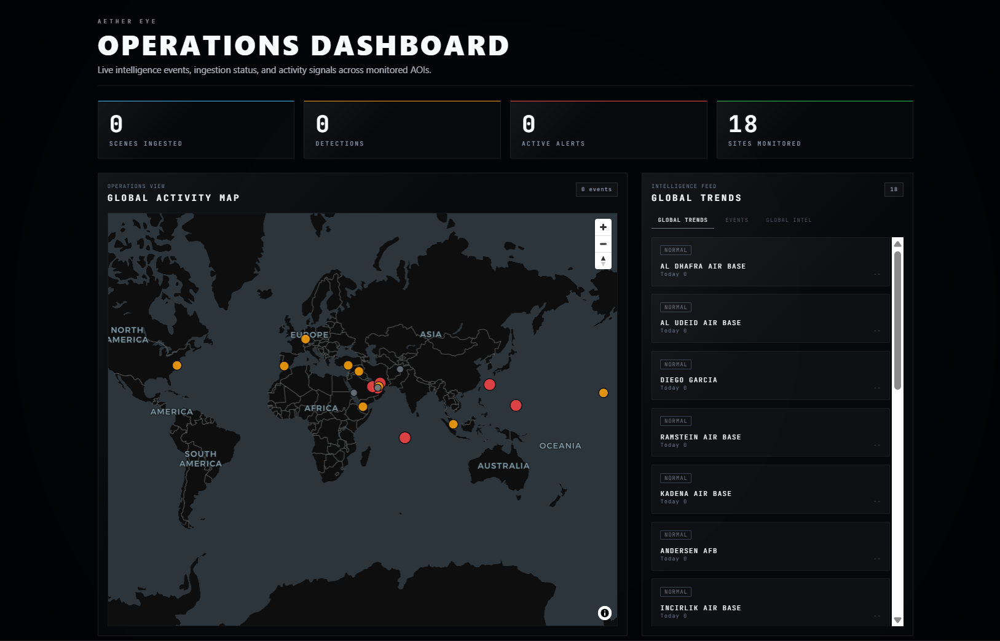
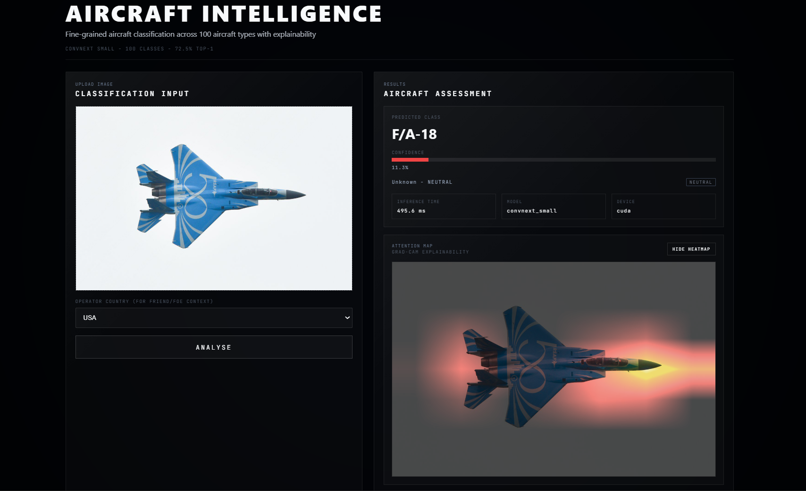
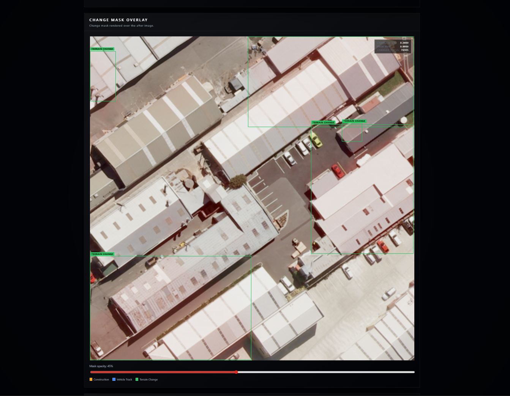

# Aether-Eye

A self-hosted, air-gappable geospatial intelligence (GEOINT) platform for persistent automated monitoring of strategic sites, change detection, and aircraft classification using Sentinel-2 imagery and local machine learning models.

---

## Overview

Aether-Eye is a high-performance, self-hosted geospatial intelligence (GEOINT) platform designed for persistent, automated monitoring of strategic military airbases, naval stations, strategic ports, and civil airports. By continuously polling the European Space Agency (ESA) Copernicus STAC server for new multispectral imagery and executing on-premises deep learning networks, the platform tracks structural changes and identifies high-value assets entirely within secure network perimeters.

Commercial cloud-based geospatial solutions often introduce operational latency, depend heavily on active internet access, and introduce significant security risks by exposing coordinates or regions of interest to third-party endpoints. Aether-Eye mitigates these risks by executing its entire pipeline—including STAC tile discovery, spectral band filtering, spatial tiling, anomaly baseline monitoring, and deep learning inference—completely locally.

For defense, intelligence, and national security organizations, self-hosting is a non-negotiable prerequisite. Aether-Eye is engineered to run in fully air-gapped, secure environments. This architectural isolation ensures that operational queries, classified locations under observation, and synthesized intelligence briefs never leave secure enclaves. It avoids reliance on external software-as-a-service (SaaS) availability and denies adversaries the ability to inspect intelligence query telemetry.

---

## Screenshots

- **Operations Dashboard**
  
  *Operations Dashboard: Real-time global site monitoring with active alert indicators, site catalog navigation, and operational timeline analysis.*

- **Aircraft Intelligence**
  
  *Aircraft Intelligence: Fine-grained identification system classifying aerial assets at airfields and bases using deep-learning models.*

- **Change Intelligence**
  
  *Change Intelligence: Pixel-level terrain and structure variation analyzer highlighting anomalies and physical changes between satellite acquisitions.*

---

## Capabilities

| Capability | Associated Service / File | Endpoints | Description |
| :--- | :--- | :--- | :--- |
| **Site Operations & Management** | `operations.py` | `/api/operations/*` | Manages operational Areas of Interest (AOIs), fetches monitored sites, site details, timeline events, and active alerts. |
| **Sentinel-2 Scene Ingestion** | `stac_watcher.py` | Background Job (APScheduler) | Automated Sentinel-2 L2A tile discovery and ingestion via the Copernicus Data Space STAC catalog. |
| **Change Detection Inference** | `change_inference.py`, `onnx_inference.py` | `/api/change_inference/*`, `/api/onnx_inference/*` | Runs pixel-level change detection on building and structure footprints using Siamese U-Net architectures. |
| **Aircraft Classification** | `aircraft_inference.py` | `/api/aircraft_inference/*` | Classifies aerial assets in uploaded or captured imagery across 100 fine-grained aircraft classes. |
| **Live Flight Vector Tracking** | `live_aircraft.py`, `flight_feed.py` | `/api/live_aircraft/*` | Aggregates, filters, and records active flight vectors over strategic coordinates to detect activity surges. |
| **OSINT Intel Feed Correlation** | `intel_feed.py` | `/api/intelligence/*` | Continuously polls public defense and world news RSS feeds, geo-tagging articles to registered bases. |
| **Platform Diagnostics** | `health.py` | `/health`, `/health/models` | Assesses core service health and verifies that PyTorch checkpoints and ONNX weights are correctly configured. |

---

## Monitored Sites

Aether-Eye persistently monitors 18 strategic sites globally, grouped by their operational classification:

### Military Airbases

| Site ID | Site Name | Country | Latitude | Longitude | Priority |
| :--- | :--- | :--- | :--- | :--- | :--- |
| `al_dhafra` | Al Dhafra Air Base | UAE | 24.258 | 54.526 | Critical |
| `al_udeid` | Al Udeid Air Base | Qatar | 25.117 | 51.315 | Critical |
| `diego_garcia` | Diego Garcia | BIOT | -7.413 | 72.451 | Critical |
| `ramstein` | Ramstein Air Base | Germany | 49.437 | 7.600 | High |
| `kadena` | Kadena Air Base | Japan | 26.356 | 127.769 | Critical |
| `andersen_guam` | Andersen AFB | Guam | 13.584 | 144.930 | Critical |
| `incirlik` | Incirlik Air Base | Turkey | 37.002 | 35.426 | High |
| `al_asad` | Al-Asad Air Base | Iraq | 33.786 | 42.441 | High |
| `bagram` | Bagram Air Base | Afghanistan | 34.946 | 69.265 | Medium |

### Naval Bases

| Site ID | Site Name | Country | Latitude | Longitude | Priority |
| :--- | :--- | :--- | :--- | :--- | :--- |
| `norfolk_naval` | Naval Station Norfolk | USA | 36.938 | -76.309 | High |
| `rota_naval` | Naval Station Rota | Spain | 36.645 | -6.349 | High |
| `pearl_harbor` | Pearl Harbor Naval Base | USA | 21.355 | -157.978 | High |
| `changi_naval` | Changi Naval Base | Singapore | 1.391 | 104.013 | High |

### Strategic Ports

| Site ID | Site Name | Country | Latitude | Longitude | Priority |
| :--- | :--- | :--- | :--- | :--- | :--- |
| `strait_hormuz_north` | Bandar Abbas Port | Iran | 27.189 | 56.271 | Critical |
| `aden_port` | Port of Aden | Yemen | 12.779 | 45.029 | High |
| `jeddah_port` | Jeddah Islamic Port | Saudi Arabia | 21.462 | 39.143 | Medium |

### Civil Airports

| Site ID | Site Name | Country | Latitude | Longitude | Priority |
| :--- | :--- | :--- | :--- | :--- | :--- |
| `dubai_airport` | Dubai International Airport | UAE | 25.253 | 55.366 | High |
| `abu_dhabi_airport` | Abu Dhabi International | UAE | 24.433 | 54.651 | Medium |

---

## Architecture

```text
                  +--------------------------------------------------+
                  |               COPERNICUS DATA SPACE              |
                  |                (Sentinel-2 STAC)                 |
                  +------------------------+-------------------------+
                                           |
                                           | STAC Queries / HTTPS
                                           v
                  +--------------------------------------------------+
                  |                  TILING ENGINE                   |
                  |     (Spectral Filtering & Tile Generation)       |
                  +------------------------+-------------------------+
                                           |
                                           | Save TIFFs / Tiles
                                           v
+------------------+      +----------------------------------+      +----------------------+
|    OSINT RSS     |      |         FASTAPI BACKEND          |      |  FLIGHT FEEDS (ADS-B)|
|   (BBC, Sky,     |----->|     - APScheduler Background Jobs|----->|  - Ingestion         |
| Breaking Defense)|      |     - DB CRUD Operations         |      |  - live_aircraft.py  |
+------------------+      +-----------------+----------------+      +----------------------+
                                            |
                                            | SQLAlchemy AsyncPG
                                            v
                                  +-------------------+
                                  | POSTGRES + POSTGIS|
                                  |    (aether_eye)   |
                                  +-------------------+
                                            |
                                            | ONNX Model Ingestion
                                            v
+------------------------------------------------------------------------------------------+
|                                    ML INFERENCE PIPE                                     |
|  +---------------------------------------+    +---------------------------------------+  |
|  |             SIAMESE U-NET             |    |            CONVNEXT-SMALL             |  |
|  | (Change Detection on Building-change) |    |  (Aircraft Classifier - 100 Classes)  |  |
|  +---------------------------------------+    +---------------------------------------+  |
+-------------------------------------------+----------------------------------------------+
                                            |
                                            | JSON API REST Endpoints
                                            v
                  +--------------------------------------------------+
                  |                   NEXT.JS UI                     |
                  |  - Operations Dashboard                          |
                  |  - Aircraft & Change Intelligence Visualizers    |
                  +--------------------------------------------------+
```

---

## Quick Start

Aether-Eye supports two primary launch methodologies depending on whether you require a full production-like deployment or a local development workspace.

### Path A: Docker (Production)

Deploy the entire containerized architecture using a single command:

```bash
docker compose up -d
```

### Path B: Local Development (Development)

Run the database services in Docker while launching the backend server and frontend client natively on your local machine.

1. **Database Only (Docker)**:
   ```bash
   docker compose up -d db
   ```

2. **FastAPI Backend Setup**:
   ```bash
   # Navigate to backend and install requirements
   cd backend
   pip install -r requirements.txt
   
   # Run database migrations using Alembic
   alembic upgrade head
   
   # Start the Uvicorn web server
   uvicorn app.main:app --host 0.0.0.0 --port 8000 --reload
   ```

3. **Next.js Frontend Setup**:
   ```bash
   # Navigate to frontend and install packages
   cd frontend
   npm install
   
   # Start the React/Next.js development server
   npm run dev
   ```

---

## Demo Mode

To run in Demo Mode and pre-populate the operational tables with realistic telemetry (including historical baseline scores, simulated satellite scenes, change detections, active alerts, and geotagged news articles for Al Dhafra, Al Udeid, Strait of Hormuz, Kadena, Ramstein, and Dubai Airport), execute:

```bash
python scripts/seed_demo_data.py --reset
```

Alternatively, on Windows systems, execute the automated setup script in PowerShell:

```powershell
./scripts/demo_start.ps1
```

---

## Tech Stack

The operational system comprises only verified dependencies listed directly within `requirements.txt`, `backend/requirements.txt`, `ml_core/pyproject.toml`, and the frontend `package.json`:

| Component | Library / Framework | Version Requirement | Description |
| :--- | :--- | :--- | :--- |
| **Backend Framework** | `FastAPI` | `>=0.110.0` | High-performance async web framework |
| **Web Server** | `Uvicorn` | `>=0.29.0` | ASGI server implementation |
| **Database ORM** | `SQLAlchemy` | `>=2.0.25` | Async database mapper and toolkit |
| **Migration Tool** | `Alembic` | `>=1.14.0` | Relational schema evolution manager |
| **Spatial Engine** | `GeoAlchemy2` | `>=0.15.2` | GIS extension integrating PostGIS |
| **Raster Operations** | `Rasterio` | `>=1.3.10` | GeoTIFF reading and spectral analysis |
| **Projections Engine** | `Pyproj` | `>=3.6.1` | Geodetic coordinate transformations |
| **Image Analysis** | `OpenCV-Python-Headless` | `>=4.9.0.80` | Image processing and matrix operations |
| **Deep Learning** | `Torch`, `Torchvision` | Latest | Deep learning neural networks framework |
| **ONNX Runtime** | `ONNX Runtime` | `>=1.17.0` | Fast optimized CPU/GPU model evaluation |
| **Task Scheduling** | `APScheduler` | `>=3.10.4` | In-process background job scheduler |
| **Network Client** | `HTTPX` | `>=0.28.0` | Multi-threaded async network requests |
| **Feed Parser** | `Feedparser` | `>=6.0.11` | Open-source feed parser for OSINT news |
| **ML Model Architectures**| `timm` | `>=0.9.0` | Custom deep-learning models support |
| **ML Detection** | `ultralytics` | `>=8.1.0` | Custom object detection suite |
| **Deep CAM Overlays** | `grad-cam` | `>=1.5.5` | Machine learning explainability toolkit |
| **Web Client UI** | `Next.js` | `16.1.6` | Production server-side rendered application |
| **Interactive Map** | `MapLibre GL` | `^5.19.0` | High-performance interactive 2D map engine |
| **3D Rendering** | `Three.js` (with `@react-three/fiber` & `@react-three/drei`) | `^0.183.2` | Interactive 3D graphics visualization |
| **Language Support** | `TypeScript` | `^5` | Strongly-typed operational interface |

---

## Data Sources

The platform extracts, cleans, and correlates raw geospatial and intelligence feeds through the following verified ingestion pathways:

| Source | Type | Endpoint / Integration | Description |
| :--- | :--- | :--- | :--- |
| **Copernicus Data Space** | Satellite Imagery | `https://catalogue.dataspace.copernicus.eu/stac` | Sourced via Sentinel-2 L2A collections (`sentinel-2-l2a`) for multispectral surface tiles. |
| **BBC News** | OSINT News Feed | `https://feeds.bbci.co.uk/news/world/rss.xml` | Public global RSS world feed (Tier 1). |
| **Sky News** | OSINT News Feed | `https://feeds.skynews.com/feeds/rss/world.xml` | Public international RSS news feed (Tier 1). |
| **Breaking Defense** | Tactical RSS Feed | `https://breakingdefense.com/feed` | Defense-focused aviation, land, and naval feed (Tier 2). |
| **Al Jazeera** | Regional News Feed | `https://www.aljazeera.com/xml/rss/all.xml` | Comprehensive Middle East and global RSS feed (Tier 2). |
| **Arab News** | Regional News Feed | `https://www.arabnews.com/rss.xml` | Regional news coverage across Saudi Arabia and the Gulf (Tier 2). |
| **The National UAE** | Regional News Feed | `https://www.thenationalnews.com/rss` | Middle Eastern tactical geopolitical news (Tier 2). |
| **Middle East Eye** | Regional News Feed | `https://www.middleeasteye.net/rss` | Regional intelligence and regional conflict tracking (Tier 2). |
| **Task and Purpose** | Tactical RSS Feed | `https://taskandpurpose.com/feed` | Military news, updates, and defense equipment analysis (Tier 3). |
| **The Aviationist** | Aviation RSS Feed | `https://theaviationist.com/feed` | Military aviation operational updates and airfield tracking (Tier 3). |
| **Naval News** | Maritime RSS Feed | `https://www.navalnews.com/feed` | Global naval activities, carrier groups, and harbor tracking (Tier 3). |

---

## Model Performance

The platform employs two production-ready models for automated spatial categorization. The performance indicators below are loaded directly from verified system training metrics:

| Model Purpose | Neural Network Architecture | Loss Function | Trained Dataset | Primary Metric | Auxiliary Metric | Checkpoint / Weights Path |
| :--- | :--- | :--- | :--- | :--- | :--- | :--- |
| **Change Detection** | Siamese U-Net (`SiameseUNet`) | Hybrid Tversky (`hybrid_tversky`) | Building-change (WHU-style) (1,134 train, 126 val, 690 test samples) | **0.7936** Validation IoU | Epoch 47 best val score | `ml_core/artifacts/change_model_v2/change_model_v2.pt` |
| **Aircraft Classification** | `ConvNeXt-Small` | Cross-Entropy Loss | FGVC Aircraft (100 distinct aircraft classes) | **72.52%** Validation Top-1 Accuracy | **71.99%** Validation Macro F1 | `experiments/aircraft/run_04_convnext_small/best.pt` |

---

## Project Structure

- `backend/`: Core REST API service implemented with FastAPI, including database models, routes, and business logic.
- `data/`: Local storage for raw satellite scenes, processed tiles, and spatial cache records.
- `database/`: Database storage directory (contains SQLite db file when not running in Docker).
- `event_pipeline/`: Workspace for event pipelines and asynchronous alerts processing.
- `experiments/`: Research training records, configuration runs, and model evaluation metrics (e.g. ConvNeXt-Small).
- `frontend/`: Single Page Application (SPA) dashboard built using Next.js and MapLibre GL.
- `ml_core/`: Core machine learning codebase containing model architectures, training loops, and production model cards.
- `ml_inference/`: ONNX model inference utilities, geo-projections, and deployment pipelines.
- `mock_dataset/`: Synthetic building change detection dataset with labels and validation splits.
- `output/`: Folder for inference imagery outputs and evaluation exports.
- `runs/`: Directory storing YOLO/ML training runs and TensorBoard logs.
- `satellite_ingestion/`: Sentinel-2 scene download tools and Copernicus STAC clients.
- `scripts/`: System scripting utilities for seeding database, environment setup, and demo execution.
- `tests/`: Automated test suite covering spectral filtering, tiling, timelines, database models, and upload validations.
- `tiling_engine/`: Image segmentation, geographic tile generator, and spectral band filters.

---

## Known Limitations

- **Air-Gapped RSS Feed Dependency**: The news feeds in `intel_feed.py` connect directly to live public RSS urls (`feeds.bbci.co.uk`, etc.). In a strictly air-gapped secure deployment, these external fetches will time out and fail silently, requiring a configured local RSS proxy or manual import tool.
- **Sequential STAC Query Rate-Limiting**: The Copernicus STAC queries inside `stac_watcher.py` execute sequentially with a hardcoded `asyncio.sleep(3)` delay between sites to avoid 429 errors. A faster parallel query system with dynamic backoff is not yet implemented.
- **Single-Threaded Flight Feed Ingestion**: The flight feed ingestor (`flight_feed.py` and `live_aircraft.py`) queries states synchronously or via simple database commits without deep queue management, making it vulnerable to data dropouts during highly congested aerospace events.
- **Environment-Specific Path Bindings**: Several model config configurations and metrics paths (e.g., in `metrics.json` pointing to `C:\Computing\Aether-eye\...`) are bound to absolute local structures, requiring manual configuration cleanup during deployments on alternative operating systems or layouts.

---

## Deployment

Aether-Eye is a fully self-contained system. Core intelligence collection, tiling, baselining, and neural network evaluations can run without any outgoing cloud queries.

### Production Environment (Docker Compose)

The standard secure configuration packages the applications into container volumes:
- **FastAPI / ML Engine**: Built with native PyTorch and ONNX execution bindings using `Dockerfile.backend`.
- **Next.js Dashboard**: Packaged and optimized using `Dockerfile.frontend`.
- **Spatial Storage**: Runs a localized `postgis/postgis:16-3.4` container.

### Cloud Environment (Alternative Deployment Path)

For public proof-of-concept deployments where no local infrastructure is available, Aether-Eye can run across the following hosting providers:
- **Spatial Database**: Supabase (PostgreSQL 15+ instance with the `postgis` extension enabled via the dashboard).
- **Backend Service**: Render (utilizing a Python 3.10+ deployment environment with dynamic environment variable `DATABASE_URL` linked to Supabase).
- **Frontend Dashboard**: Vercel (seamlessly deploying the static Next.js production build linked to the Render API endpoint).

---

## License

Proprietary — All Rights Reserved. Authorized military/government agency use only.
