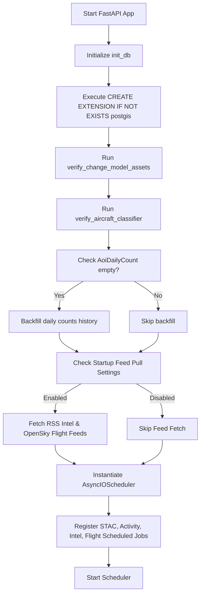
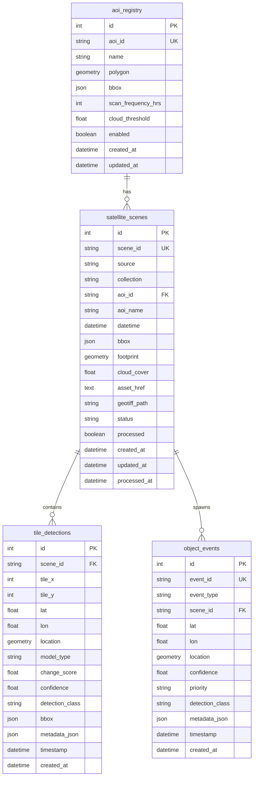

# Technical Architecture Manual

This document provides a comprehensive technical architecture overview of the Aether-Eye platform, designed specifically for system architects, developers, and technical evaluators.

---

## 1. System Overview

Aether-Eye is designed as an autonomous, self-hosted, defense-oriented intelligence platform. It utilizes a four-layer architecture pattern to decouple the UI representation, data collection services, background ingestion pipelines, and specialized local machine learning runners.

```
+-----------------------------------------------------------------------+
|                        FRONTEND PRESENTATION                          |
|             Next.js 15 (App Router) | MapLibre GL spatial map         |
+------------------------------------+----------------------------------+
                                     | (Same-origin Proxy /api/*)
                                     v
+-----------------------------------------------------------------------+
|                         BACKEND API LAYER                             |
|          FastAPI REST API | asyncpg | APScheduler orchestrator        |
+------------------------------------+----------------------------------+
                                     | (Shared Database & IPC)
                                     v
+-----------------------------------------------------------------------+
|                    DATA FEEDS & PIPELINE ENGINES                      |
|  STAC Scene Watcher | Tiling Engine | Event Engine | Flight & Intel   |
+------------------------------------+----------------------------------+
                                     | (Direct ONNX Runtime Callbacks)
                                     v
+-----------------------------------------------------------------------+
|                          MACHINE LEARNING                             |
|    ONNX Runtime (Siamese U-Net v2) | PyTorch (ConvNeXt-Small 100cls)  |
+-----------------------------------------------------------------------+
```

### Architectural Layer Responsibilities
*   **Frontend Presentation (Next.js)**: A lightweight, responsive visualization dashboard. It coordinates spatial tracking via MapLibre GL, encapsulates client state using native React hooks/contexts (eliminating heavy external state engines), and proxies all requests through a same-origin catch-all route to avoid CORS challenges in air-gapped secure networks.
*   **Backend API Layer (FastAPI)**: Serving as the system's central command post, this asynchronous gateway translates HTTP requests, handles high-throughput asynchronous database transactions via SQLAlchemy 2.0 and `asyncpg`, manages active database operations, and runs an integrated job scheduler (APScheduler) to drive periodic feeds.
*   **Data Feeds & Pipeline Engines (Ingestion & Analysis)**: A series of background engines executing decoupled data collection. This includes a STAC metadata scene crawler, a multi-core geospatial raster tiler, an event engine that calculates surge anomalies against dynamic rolling historical baselines, and parallel API state pollers for intelligence feeds (RSS) and flights (OpenSky ADS-B).
*   **Machine Learning (Inference)**: Decoupled, local-first inference runtimes utilizing high-performance ONNX Runtime and PyTorch backends. These execute spatial change segmentation and airframe variant identification directly on local CPU or GPU resources, ensuring no external network leaks.

---

## 2. Backend Architecture

### FastAPI Application Structure
The backend is structured to separate concern areas: routing, data contracts (schemas), business models, and service interfaces.

```
backend/
├── alembic/                  # Database migration scripts
├── app/
│   ├── api/
│   │   ├── routes/           # REST endpoints grouped by subdomain
│   │   └── upload_utils.py   # Secure file upload multipart parsers
│   ├── core/
│   │   ├── config.py         # Pydantic Settings env definitions
│   │   └── tasks.py          # Background worker job interfaces
│   ├── database/
│   │   ├── models.py         # SQLAlchemy Base ORM schemas
│   │   └── session.py        # Connection pools and SSL overrides
│   ├── schemas/              # Pydantic data contract validations
│   ├── services/             # Core service layers (geopolitical, etc.)
│   └── main.py               # Application factory & startup hooks
├── configs/
│   ├── inference/            # Model inference threshold definitions
│   └── monitoring/           # Protected sites registry
└── pipeline/                 # Core scene processor pipelines
```

### Router Registration
All endpoints are aggregated inside the core FastAPI application factory (`app/main.py`) under the prefix `/api` using dynamic imports to verify stability:

1.  **`health`**: Basic health state checking.
2.  **`inference`**: Generic raw change segmenter interface.
3.  **`onnx_inference`**: High-performance ONNX model triggers.
4.  **`vit_explainability`**: Grad-CAM heatmap generator endpoints.
5.  **`aircraft_inference`**: Fine-grained airframe classifier interface.
6.  **`change_inference`**: Spatial temporal change endpoints.
7.  **`intelligence`**: Site feeds and processing endpoints.
8.  **`live_aircraft`**: ADS-B spatial matching endpoints.
9.  **`operations`**: Core statistics counters, historical event logs, and status updates for the dashboard.

### Middleware
*   **CORS (Cross-Origin Resource Sharing)**: Configured via `CORSMiddleware`. Explicitly restricts origins to localhost development routes (`http://localhost:3000`, `http://127.0.0.1:3000`) and enforces strict regular expression validation to deny arbitrary external origins while supporting secure air-gapped domain resolution.
*   **File Upload Limits**: Managed at the routing layer through streaming file buffers, preventing denial-of-service memory pressure from large satellite image uploads.

### Startup Sequence
When uvicorn/gunicorn initializes the FastAPI application, the following startup events occur in order:



### Database Session Management (Async SQLAlchemy)
Database transactions are built on SQLAlchemy 2.0 with the `asyncpg` driver:

*   **Connection Pooling**: Managed via `create_async_engine` using `pool_pre_ping=True` to automatically drop stale connections, a crucial safety check for long-running deployments.
*   **Dependency Injection**: Endpoint paths acquire database connections using the FastAPI dependency injection framework:
    ```python
    async def get_db():
        async with async_session() as session:
            yield session
    ```
    This ensures that each HTTP request operates on its own dedicated transaction, which is committed or rolled back automatically upon request completion.

### Scheduler Setup (APScheduler Jobs)
The `AsyncIOScheduler` orchestrates background intelligence gathering inside the same process loop:

| Job ID | Task Target | Trigger Type | Interval / Recurrence | Purpose |
| :--- | :--- | :--- | :--- | :--- |
| `stac_watcher` | `run_watcher()` | `interval` | `360` minutes (configurable) | Discovers and queues incoming Copernicus STAC scenes |
| `activity_aggregator` | `aggregate_aircraft_activity()` | `interval` | `24` hours (configurable) | Aggregates daily aircraft counts and triggers alerts |
| `intel_feed_fetch` | `fetch_and_store_articles()` | `interval` | `30` minutes | Polls global news RSS and tags military interest sites |
| `flight_feed_fetch` | `fetch_flights_for_sites()` | `interval` | `5` minutes | Queries OpenSky ADS-B states for active flights |

---

## 3. Database Schema

Aether-Eye uses a relational PostgreSQL schema enhanced with PostGIS spatial geometries (SRID 4326) for efficient geographic boundary and coordinate lookups.



### Table Schema Definitions

#### 1. `aoi_registry`
Represents the monitored geographic Areas of Interest (e.g., military airfields, deep-water ports).
*   `id` (Integer, Primary Key)
*   `aoi_id` (String, Unique, Index, Non-nullable)
*   `name` (String, Index, Non-nullable)
*   `polygon` (Geometry("POLYGON", srid=4326), Non-nullable) — Spatial footprint of the AOI.
*   `bbox` (JSON, Nullable) — Bounding box limits.
*   `scan_frequency_hrs` (Integer, Default: 6)
*   `cloud_threshold` (Float, Default: 20.0)
*   `enabled` (Boolean, Default: True)
*   `created_at`/`updated_at` (DateTime with timezone)

#### 2. `satellite_scenes`
Tracks discovered, downloaded, and processed satellite raster files.
*   `id` (Integer, Primary Key)
*   `scene_id` (String, Unique, Index, Non-nullable)
*   `source` (String, Default: "copernicus-dataspace")
*   `collection` (String, Default: "sentinel-2-l2a")
*   `aoi_id` (String, ForeignKey `aoi_registry.aoi_id`)
*   `aoi_name` (String, Nullable)
*   `datetime` (DateTime with timezone, Index, Non-nullable)
*   `bbox` (JSON)
*   `footprint` (Geometry("POLYGON", srid=4326), Nullable)
*   `cloud_cover` (Float, Nullable)
*   `asset_href` (Text) — Upstream remote download link.
*   `geotiff_path` (String, Nullable) — Local storage path.
*   `status` (String, Default: "DISCOVERED")
*   `processed` (Boolean, Default: False, Index)
*   `created_at`/`updated_at` (DateTime with timezone)
*   `processed_at` (DateTime with timezone, Nullable)

#### 3. `tile_detections`
Individual $512 \times 512$ tile segment detections containing physical pixel changes.
*   `id` (Integer, Primary Key)
*   `scene_id` (String, ForeignKey `satellite_scenes.scene_id`, Non-nullable)
*   `tile_x`/`tile_y` (Integer, Non-nullable) — Pixel coordinates in the original scene.
*   `lat`/`lon` (Float, Non-nullable) — Geo-coordinates of the tile center.
*   `location` (Geometry("POINT", srid=4326), Non-nullable) — Spatial index point.
*   `model_type` (String, Index, Non-nullable) — E.g., `change_detection`.
*   `change_score`/`confidence` (Float, Nullable)
*   `detection_class` (String, Index, Nullable) — E.g., `terrain_change`.
*   `bbox` (JSON, Nullable)
*   `metadata_json` (JSON, Nullable) — Tracks change pixels and raw spectral scores.
*   `timestamp`/`created_at` (DateTime with timezone)

#### 4. `object_events`
Geospatial alerts and operational events triggered by the `Event Engine`.
*   `id` (Integer, Primary Key)
*   `event_id` (String, Unique, Index, Non-nullable)
*   `event_type` (String, Index, Non-nullable) — E.g., `NEW_OBJECT`, `ACTIVITY_SURGE`.
*   `scene_id` (String, ForeignKey `satellite_scenes.scene_id`, Nullable)
*   `lat`/`lon` (Float, Non-nullable)
*   `location` (Geometry("POINT", srid=4326), Non-nullable)
*   `confidence` (Float)
*   `priority` (String, Default: "MEDIUM") — `HIGH`, `MEDIUM`, `LOW`.
*   `detection_class` (String, Nullable)
*   `metadata_json` (JSON, Nullable) — Includes surge metrics and historical base scores.
*   `timestamp`/`created_at` (DateTime with timezone)

#### 5. `activity_alerts`
High-level aggregated activity notifications.
*   `id` (Integer, Primary Key)
*   `alert_id` (String, Unique, Index, Non-nullable)
*   `alert_type` (String, Index, Non-nullable)
*   `location_name` (String, Nullable)
*   `lat`/`lon` (Float, Nullable)
*   `location` (Geometry("POINT", srid=4326), Nullable)
*   `severity` (String, Default: "MEDIUM")
*   `triggered_at`/`created_at` (DateTime with timezone)
*   `payload` (JSON, Nullable)
*   `tile_id`/`event_type`/`window_start`/`window_end` (Nullable compatibility keys)
*   `previous_count`/`current_count`/`delta` (Integer, Nullable)

#### 6. `aoi_daily_counts`
Tracks daily activity counts per site and class to construct historical averages.
*   `id` (Integer, Primary Key)
*   `aoi_id` (String(64), Index, Non-nullable)
*   `date` (Date, Non-nullable)
*   `event_type` (String(64), Index, Non-nullable)
*   `count` (Integer, Default: 0)
*   `updated_at` (DateTime with timezone)
*   *Unique Constraint*: `uq_aoi_daily_counts_aoi_date_event` on `(aoi_id, date, event_type)`

#### 7. `intel_articles`
Persisted global news feed articles tagged to monitored sites.
*   `id` (Integer, Primary Key)
*   `site_id` (String(64), Index, Nullable) — Nullable for global news.
*   `title` (Text, Non-nullable)
*   `url` (Text, Unique, Non-nullable)
*   `source` (String(128))
*   `source_tier` (Integer, Default: 2)
*   `published_at`/`fetched_at` (DateTime with timezone)
*   `summary` (Text, Nullable)

#### 8. `flight_states`
Active flight records captured around monitored locations.
*   `id` (Integer, Primary Key)
*   `icao24` (String(16), Index, Non-nullable)
*   `callsign` (String(32), Nullable)
*   `origin_country` (String(64), Nullable)
*   `lat`/`lon` (Float, Nullable)
*   `altitude_m`/`velocity_ms`/`heading` (Float, Nullable)
*   `on_ground` (Boolean, Default: False)
*   `site_id` (String(64), Index, Nullable)
*   `timestamp` (DateTime with timezone, Index, Non-nullable)
*   `fetched_at` (DateTime with timezone)
*   *Unique Constraint*: `uq_flight_states_icao24_timestamp` on `(icao24, timestamp)`

#### 9. `flight_daily_counts`
Tracks flight traffic parameters.
*   `id` (Integer, Primary Key)
*   `site_id` (String(64), Index, Non-nullable)
*   `date` (Date, Non-nullable)
*   `count` (Integer, Default: 0)
*   `unique_aircraft` (Integer, Default: 0)
*   `updated_at` (DateTime with timezone)
*   *Unique Constraint*: `uq_flight_daily_counts_site_date` on `(site_id, date)`

#### 10. `ingestion_state`
Coordinates incremental STAC scene watcher discovery times.
*   `id` (Integer, Primary Key)
*   `aoi_id` (String, Unique, Index)
*   `last_timestamp` (DateTime with timezone, Nullable)
*   `updated_at` (DateTime with timezone)

### Migration History
Alembic manages incremental schema migrations (`backend/alembic/versions/`):

1.  **`0001_stage2_monitoring.py`**: Initializes core PostGIS tables (`aoi_registry`, `satellite_scenes`, `tile_detections`, `object_events`, `activity_alerts`).
2.  **`0002_aoi_daily_counts.py`**: Adds daily metrics trackers and registers unique indexing constraints on historic timelines.
3.  **`0003_intel_articles.py`**: Adds the `intel_articles` table and tags to support geolocation-based intelligence feeds.
4.  **`0004_flight_states.py`**: Adds tables for OpenSky flight tracking (`flight_states`, `flight_daily_counts`) and associated location spatial buffers.

---

## 4. Pipeline Architecture

The ingestion and analysis pipeline processes incoming raw satellite rasters and extracts localized actionable intelligence.

```
+------------------+     +--------------------+     +------------------------+
|   STAC Watcher   | --> |     Tiler Engine   | --> |    Scene Processor     |
|  Query Copernicus|     |   Slice GeoTIFF to |     | Run Siamese U-Net v2   |
|  metadata & queue|     |   512x512 windows  |     | on paired temporal chips|
+------------------+     +--------------------+     +------------------------+
                                                                |
                                                                v
+------------------+     +--------------------+     +------------------------+
|  Site Aggregator | <-- |    Event Engine    | <---+ Save raw tile          |
|  Calculate daily |     | Spatial clustering |     | detections in database |
|  activity counts |     | and baseline comparisons|                     |
+------------------+     +--------------------+     +------------------------+
```

### 1. STAC Watcher
The STAC Watcher checks the Copernicus Data Space STAC catalog (`https://catalogue.dataspace.copernicus.eu/stac`) for updates.
*   It query-filters Sentinel-2 L2A collections using the bounding boxes of enabled sites in the registry.
*   Queries restrict discoveries using `eo:cloud_cover <= 30` (or the configured threshold).
*   Any newly discovered scene is saved to `satellite_scenes` with status `DISCOVERED`.
*   A background async task is dispatched to download the visual bands and run full local processing.

### 2. Tiling Engine
To analyze large geographic rasters without running out of memory, Aether-Eye tiles raw geotiff scenes using `rasterio`:
*   **Windowed Slicing**: Slices spatial rasters into overlapping segments using a default window size of $512 \times 512$ pixels (`iter_tiles` and `iter_paired_tiles` in `tiler.py`).
*   **Temporal Registration**: Evaluates multi-temporal acquisitions simultaneously. The tiler aligns the pixels of "Before" and "After" scenes to guarantee perfect spatial registration.
*   **Coordinate Projection**: Projects pixel coordinate windows into global coordinates (WGS84 EPSG:4326) using `rasterio.warp.transform_bounds`.

### 3. Scene Processor
The Scene Processor coordinates the execution of the local machine learning models:
*   **Radiometric Filtering**: Before running the neural network, the pipeline computes a raw spectral change coefficient between the temporal tiles (`compute_change_score`). If the spectral difference is below a minimum threshold (`spectral_threshold=0.05`), the tile is skipped to save computation time.
*   **Model Execution**: For changed tiles, the system converts the raw geospatial bands to standard BGR image format (`_tile_to_bgr`) and passes the temporal pairs to the Siamese U-Net model.
*   **Storage**: Segmentations with a change score exceeding the minimum threshold (`min_change_score=0.05`) are saved to the database as `tile_detections`.

### 4. Event Engine
The Event Engine groups individual pixel detections into high-level alerts using spatial clustering and historical baselines:
*   **Spatial Binning**: Groups detections into coordinate bins using a spatial grid size of `0.01` degrees (roughly $1.1$ km).
*   **Baseline Comparison**: For each cluster, the engine queries the `aoi_daily_counts` table to retrieve the rolling 30-day historical average (`get_aoi_baseline`).
*   **Anomalous Event Detection**: Calculates a surge factor:
    $$\text{Surge Factor} = \frac{\text{Current Cluster Size}}{\text{Historical 30-Day Average}}$$
*   **Event Generation Rules**:
    *   **`NEW_OBJECT`**: Triggered when `baseline == 0` and `current_count > 0` (Low priority).
    *   **`ACTIVITY_SURGE`**: Triggered when `surge_factor >= 3.0` (High priority, logs critical alerts).
    *   **`ELEVATED_ACTIVITY`**: Triggered when `surge_factor >= 1.5` (Medium priority, logs warning alerts).

### 5. Site Aggregator
Tracks and aggregates activity counts over time:
*   Updates the `aoi_daily_counts` history tables to continuously update the baseline metrics.
*   Triggers warning logs and system notifications if daily changes exceed $2.0 \times$ the baseline.

---

## 5. Intelligence Services

Aether-Eye augments satellite imagery analysis with external data feeds to provide multi-domain context.

### 1. Intel Feed
*   **RSS Polling**: Scans 10 international news and specialized defense RSS feeds (BBC, Sky News, Breaking Defense, Naval News, etc.) every 30 minutes.
*   **Geo-Tagging Algorithm**: Automatically associates crawled articles with registered AOIs using a scoring system:
    1.  **Direct Tags**: Adds $+2$ points if a site's explicit tags are found in the article text.
    2.  **Strategic Aliases**: Adds $+1$ point if keywords from a site's alias map (`ALIASES` in `intel_feed.py`) match the text.
    3.  **Geopolitical Context**: Matches generic military terms (e.g., "missile", "drone") alongside country names, adding $+1$ point to the corresponding sites.
*   The article is tagged with the highest-scoring site ID. If no matches occur, it is marked as "Global Intel" to provide general regional context.

### 2. Flight Feed
*   **OpenSky Integration**: Polls the OpenSky Network API (`https://opensky-network.org/api/states/all`) every 5 minutes.
*   **Spatial Correlation**: Queries aircraft locations within a $0.5$-degree bounding box (`SITE_BUFFER_DEGREES`) around monitored sites.
*   **ADS-B Storage**: Persists active flight records to `flight_states` and updates daily traffic counts in `flight_daily_counts`.

### 3. Site Registry
The site registry loads site configuration parameters from `backend/configs/monitoring/global_sites.yaml`:
*   **Zero-Latency Cache**: Loaded using YAML parsers and cached in memory using Python's `@lru_cache(maxsize=1)`. This avoids disk I/O bottlenecks during high-throughput map and tiler queries.
*   **Point Matching**: Coordinates are matched to sites by checking if a coordinate point falls inside a site's defined bounding box (`min_lon <= lon <= max_lon` and `min_lat <= lat <= max_lat`).

---

## 6. Frontend Architecture

The frontend is built on Next.js 15, using a modern App Router structure.

```
frontend/
├── app/
│   ├── api/
│   │   └── [...path]/ route.ts  # Catch-all Same-Origin reverse proxy handler
│   ├── aircraft-intelligence/   # Aircraft Classifier Page
│   ├── change-intelligence/     # Change Visualizer Page
│   ├── operations/              # Operations Dashboard Page
│   ├── layout.tsx               # Root template and context providers
│   └── page.tsx                 # Landing entrance page
├── components/
│   ├── operations/              # Dashboard-specific components
│   │   ├── DetectionMap.tsx     # MapLibre GL spatial map
│   │   ├── EventFeed.tsx        # Alert timeline listing
│   │   └── SiteDetailPanel.tsx  # Site detail panel (flights + news)
│   ├── BeforeAfterSlider.tsx    # Slide-to-compare temporal panel
│   └── DashboardShell.tsx       # Sidebar/Topbar layout wrapper
├── context/
│   └── CountryContext.tsx       # Geopolitical analysis context
├── lib/
│   └── api.ts                   # Axios client endpoints mapping
└── types/
    └── operations.ts            # Shared TypeScript type interfaces
```

### MapLibre GL Integration
The spatial map (`DetectionMap.tsx`) handles all spatial queries and visualizations:
*   **WebGL Performance**: Built using the `maplibre-gl` library to leverage GPU acceleration, enabling smooth rendering of thousands of coordinates.
*   **Layer Setup**:
    1.  `ops-sites-circle`: Renders monitored locations with size and color determined by site priority.
    2.  `ops-site-bboxes-fill`/`line`: Draws bounding box footprints when zoomed in.
    3.  `flights-layer`: Shows active flight paths queried from OpenSky.
    4.  `ops-events-circle`: Displays anomalous activity alerts.
*   **Etp Fallback Style**: To support air-gapped deployments and handle strict browser privacy protections, the map tries to load CartoDB dark-matter tiles first. If that fails, it falls back to local MapLibre demo tiles.

### State Management
*   **Native Context**: Client state is managed using standard React state hooks (`useState`, `useContext`) and native context providers (`CountryProvider`). This avoids the complexity and performance overhead of heavy external state libraries (e.g., Redux).
*   **API Client**: Axios manages HTTP transactions, sending all requests through the `/api` proxy.

---

## 7. API Reference

All backend API routes are registered under the `/api` prefix.

### 1. Operations Router (`app.api.routes.operations`)
Provides stats, alerts, and status updates for the dashboard.
*   `GET /api/scenes/count`
    *   **Response**: `CountResponse` `{ count: int }`
*   `GET /api/detections/count`
    *   **Response**: `CountResponse` `{ count: int }`
*   `GET /api/alerts/count`
    *   **Response**: `CountResponse` `{ count: int }`
*   `GET /api/events`
    *   **Query Params**: `hours: int = 24`, `limit: int = 100`
    *   **Response**: `list[OperationsEvent]`
*   `GET /api/site-status`
    *   **Query Params**: `days: int = 30`
    *   **Response**: `list[SiteStatusResponse]`
*   `GET /api/sites/geojson`
    *   **Response**: GeoJSON FeatureCollection containing all monitored locations.

### 2. Live Aircraft Router (`app.api.routes.live_aircraft`)
Tracks real-time flight telemetry around monitored sites.
*   `GET /api/flights/global`
    *   **Query Params**: `hours: int = 1`
    *   **Response**: `list[FlightStateResponse]`
*   `GET /api/sites/{site_id}/flights`
    *   **Query Params**: `hours: int = 24`
    *   **Response**: `FlightActivityResponse`

### 3. Intelligence Router (`app.api.routes.intelligence`)
Provides tagged news articles for monitored locations.
*   `GET /api/intel/global`
    *   **Query Params**: `hours: int = 48`
    *   **Response**: `list[IntelArticleResponse]`
*   `GET /api/sites/{site_id}/intel`
    *   **Query Params**: `hours: int = 48`
    *   **Response**: `SiteIntelResponse` `{ site_id: str, articles: list }`

### 4. ML Inference Router (`app.api.routes.vit_explainability`)
Provides fine-grained aircraft classification and model explainability.
*   `POST /api/v1/aircraft-classify`
    *   **Body**: `Multipart/FormData` (`image: File`, `country: str = "USA"`)
    *   **Response**: `AircraftClassificationResponse`
*   `POST /api/v1/aircraft-gradcam`
    *   **Body**: `Multipart/FormData` (`image: File`, `target_class: int = None`)
    *   **Response**: `AircraftGradCamResponse` `{ heatmap_base64_png: str, confidence: float }`

### 5. Change Detection Router (`app.api.routes.onnx_inference`)
Provides change detection inference.
*   `POST /api/v1/change-detection`
    *   **Body**: `Multipart/FormData` (`before_image: File`, `after_image: File`, `include_mask: bool = False`, `semantic: bool = False`)
    *   **Response**: `ChangeDetectionResponse`

---

## 8. Configuration

Aether-Eye uses a multi-layered configuration design to balance runtime flexibility with strict deployment security.

### 1. Core Global Configuration (`config.yaml`)
Defines the directory structures for training datasets and points to active model checkpoints:
```yaml
satellite_change:
  root: data/processed/building_change
  train_list: train_list.txt
  val_list: val_list.txt
  test_list: test_list.txt
aircraft_fgvc:
  root: data/raw/aircraft
change_detection:
  checkpoint: ml_core/artifacts/change_model_v2/change_model_v2.pt
  model: siamese_unet
  threshold: 0.5
```

### 2. Environment Variables (`.env.example`)
Coordinates container services, database connection strings, and polling frequencies:
*   `DATABASE_URL`: Connection string for PostgreSQL/PostGIS.
*   `BACKEND_API_BASE_URL`: Root address of the backend service.
*   `ENABLE_STAC_WATCHER`: Toggles the background STAC catalog monitor.
*   `STAC_POLL_MINUTES`: Polling frequency for new scenes (default: 360 minutes).
*   `ENABLE_ACTIVITY_AGGREGATOR`: Toggles the daily alert aggregation engine.

### 3. Model Inference YAMLs (`backend/configs/`)
*   **Change Detection Config** (`change_detector.yaml`): Points to the production ONNX weights and model card metadata.
*   **Aircraft Classifier Config** (`aircraft_classifier.yaml`): Defines input normalization parameters ($\mu$, $\sigma$), target image resolution (224), and points to the PyTorch/ONNX model checkpoints.

---

## 9. Deployment Architecture

The system is containerized and managed using Docker Compose to ensure clean service isolation and reproducible environments.

```
                  +--------------------------------+
                  |         Docker Compose         |
                  +--------------------------------+
                                  |
            +---------------------+---------------------+
            |                     |                     |
            v                     v                     v
+-----------------------+ +-----------------------+ +-----------------------+
|        db (PostGIS)   | |        backend        | |       frontend        |
|  Image: postgis:16    | |  FastAPI REST Server | | Next.js Presentation  |
|  Port: 5432           | |  Port: 8000           | | Port: 3000            |
|  Vol: postgres_data   | |  Vol: ml_core/        | | Dep: backend          |
|  Health: pg_isready   | |       artifacts (ro)  | |                       |
+-----------------------+ +-----------------------+ +-----------------------+
```

### Health Check Chain
*   The **PostgreSQL/PostGIS Database** (`db`) runs an internal health check using `pg_isready` to verify connection readiness.
*   The **FastAPI Backend** (`backend`) sets `depends_on` to block startup until the database health check passes. It mounts the `ml_core/artifacts` directory read-only (`ro`) to load the production model weights.
*   The **Next.js Frontend** (`frontend`) starts after the backend initializes, routing all API requests through the internal Docker network.

### Git LFS for Large Model Weights
To keep the Git history clean, large model assets are tracked using Git LFS (Large File Storage). The `.gitattributes` configuration file defines LFS tracking rules for deep learning checkpoints:
```
*.pt filter=lfs diff=lfs merge=lfs -text
*.onnx filter=lfs diff=lfs merge=lfs -text
```

---

## 10. Security & Air-Gap Sovereignty

Aether-Eye is designed from the ground up for strict air-gapped security and data sovereignty:

*   **Self-Hosted Sovereignty**: The entire system runs locally inside a virtual private network or private cloud. Because it does not rely on third-party cloud APIs (such as OpenAI or external hosting services), sensitive geographic coordinates, local site names, and proprietary imagery never leak to external networks.
*   **Local Inference**: Deep learning inference for change detection and airframe classification runs entirely on local CPU or GPU resources.
*   **Air-Gap Compatibility**:
    *   **OpenSky Proxying**: In strict air-gapped environments where OpenSky cannot be reached, the flight polling engine falls back to reading local ADS-B receiver logs (via dump1090) over the local network.
    *   **RSS Mirroring**: The RSS crawler can ingest mirrored local feeds rather than querying public internet RSS feeds.
    *   **Map Styles**: If the primary CartoDB basemap is unreachable due to network restrictions, the MapLibre engine falls back to rendering pre-cached local vector tiles.
*   **CORS Safeguards**: Standard CORS headers restrict browser-side API calls to known local addresses (`localhost:3000` or the private intranet IP), blocking cross-site request attacks.
*   **Authentication (Documented Gap)**: Currently, the system does not include a user authentication layer. It is designed to run in trusted, isolated intranet networks where access control is managed at the network perimeter.
